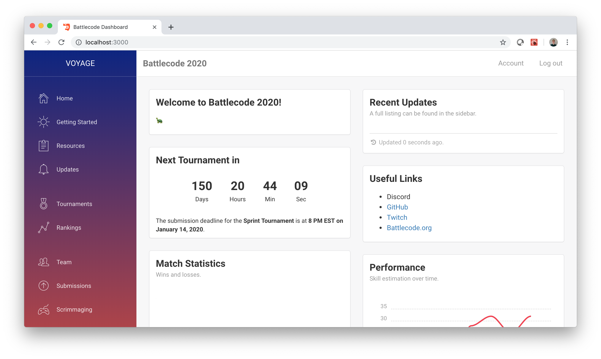

# Battlecode Frontend

Fully static frontend in React, based on `battlecode19/app`, using modified template from http://creative-tim.com. 



## Local Development

You can run `docker-compose up --build` in the root directory of `battlecode20` to run the entire website stack. If for some reason you want to run the frontend outside of Docker, follow the instructions below.

### First-Time Setup

In this directory, run:

```
npm install
```

### Running

Make sure that the backend in `../backend` is running at `localhost:8000`.

In this directory, run:

```
npm run start
```

This automatically reloads the page on changes. To run the same thing without automatically opening a browser, run `npm run startx`, and then navigate to http://localhost:3000.

### Notes

When installing a new Node package, always `npm install --save <package>` or `npm install --save-dev <package>`, and commit `package.json` and `package-lock.json`. This should work even if we run it from Docker. If you don't have `npm` installed on your computer, you can `docker exec -it battlecode20_frontend_1 sh` and then run the commands above.

## Deployment

For production, build with `npm run build` for the full thing, and `npm run buildnogame` to build the site without any game specific information. This is handled automatically by calling `./deploy.sh deploy` or `./deploy.sh deploynogame`, respectively. Note that the former should ONLY be called after the release of the game, since it makes the game specs and the visualizer public.
